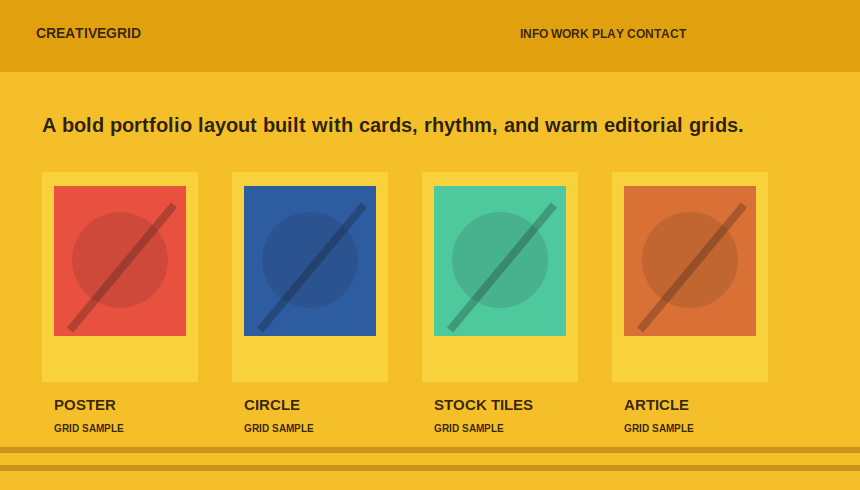

# 双向滚动网页栅格 Gallery

这是一个纯前端 HTML + CSS 示例项目，用来实现类似主题模板展示页的效果：

- 第一排网页截图向右无限滚动
- 第二排网页截图向左无限滚动
- 鼠标 hover 到图片时显示半透明遮罩
- 遮罩中包含一个按钮和一个文本链接
- 图片使用 SVG 格式，已放入 `images/` 目录
- 样式文件已独立放入 `css/` 目录
- 不依赖 JavaScript，不依赖第三方库

## 在线预览

上传到 GitHub 后，可以通过 GitHub Pages 预览：

```text
https://你的用户名.github.io/你的仓库名/
```

例如：

```text
https://coowiniris.github.io/theme-marquee-gallery/
```

## 项目结构

```text
theme-marquee-gallery/
├── index.html
├── README.md
├── css/
│   └── style.css
└── images/
    ├── theme-grid-01.svg
    ├── theme-grid-02.svg
    ├── theme-grid-03.svg
    ├── theme-grid-04.svg
    ├── theme-grid-05.svg
    ├── theme-grid-06.svg
    ├── theme-grid-07.svg
    └── theme-grid-08.svg
```

## 功能说明

### 1. 双向无限滚动

页面中有两条滚动轨道：

- `.row-right`：向右滚动
- `.row-left`：向左滚动

核心代码在 `css/style.css`：

```css
.marquee-row.row-right .marquee-track {
  animation: scroll-right var(--speed) linear infinite;
}

.marquee-row.row-left .marquee-track {
  animation: scroll-left var(--speed) linear infinite;
}
```

为了实现无缝循环，每一排图片都复制了一组相同内容。这样第一组滚动离开画面时，第二组会自然接上。

### 2. 鼠标 hover 显示遮罩

每张图片都使用 `.theme-card` 包裹，里面包含图片和 `.theme-overlay` 遮罩层。

```html
<article class="theme-card">
  
  <div class="theme-overlay">
    <a class="start-theme-btn" href="#">Start with this theme</a>
    <a class="theme-detail-link" href="#">Theme details</a>
  </div>
</article>
```

默认情况下遮罩透明：

```css
.theme-overlay {
  opacity: 0;
}
```

鼠标移动到图片上时显示：

```css
.theme-card:hover .theme-overlay,
.theme-card:focus-within .theme-overlay {
  opacity: 1;
}
```

## 如何修改图片

把你自己的网页截图放到 `images/` 目录，然后修改 `index.html` 中的图片路径即可：

```html

```

如果使用 JPG、PNG、WebP 也可以，例如：

```html

```

建议图片比例接近：

```text
860 × 490
```

或者：

```text
430 × 245
```

CSS 中已经使用：

```css
object-fit: cover;
```

所以不同尺寸的图片也会自动裁切填充卡片。

## 如何修改滚动速度

在 `css/style.css` 的 `:root` 中修改：

```css
--speed: 34s;
```

数值越小，滚动越快；数值越大，滚动越慢。

例如：

```css
--speed: 24s;
```

会比默认速度更快。

## 如何修改卡片尺寸

在 `css/style.css` 的 `:root` 中修改：

```css
--card-width: 430px;
--card-height: 245px;
```

如果想让卡片更大，可以改成：

```css
--card-width: 520px;
--card-height: 296px;
```

## 如何修改间距

修改变量：

```css
--gap: 24px;
```

数值越大，图片之间的距离越大。

## 如何修改按钮和链接

按钮文字在 `index.html` 中：

```html
<a class="start-theme-btn" href="#">Start with this theme</a>
<a class="theme-detail-link" href="#">Theme details</a>
```

你可以改成中文：

```html
<a class="start-theme-btn" href="#">使用这个主题</a>
<a class="theme-detail-link" href="#">查看主题详情</a>
```

也可以把 `href="#"` 改成真实链接。

## 上传到 GitHub 的步骤

### 方法一：直接网页上传

1. 新建一个 GitHub 仓库，例如：`theme-marquee-gallery`
2. 上传本项目中的所有文件和文件夹
3. 进入仓库的 `Settings`
4. 找到 `Pages`
5. Source 选择 `Deploy from a branch`
6. Branch 选择 `main`，目录选择 `/root`
7. 保存后等待 GitHub Pages 构建完成

### 方法二：命令行上传

```bash
git init
git add .
git commit -m "Initial commit: add two-way marquee theme gallery"
git branch -M main
git remote add origin https://github.com/你的用户名/你的仓库名.git
git push -u origin main
```

## 推荐仓库信息

### Repository name

```text
theme-marquee-gallery
```

### Description

```text
纯 HTML + CSS 实现的双向无限滚动网页栅格展示页，支持 hover 遮罩、按钮和详情链接。
```

### Topics

```text
html
css
svg
marquee
gallery
github-pages
frontend
web-design
```

## 推荐 Commit 信息

### Commit title

```text
Initial commit: add two-way marquee theme gallery
```

### Commit description

```text
- 新增 index.html 页面结构
- 新增 css/style.css 独立样式文件
- 新增 8 张 SVG 网页栅格示例图
- 实现双排相反方向无限滚动
- 实现 hover 半透明遮罩、按钮和详情链接
- 新增中文版 README 使用说明
```

## 推荐 Release 信息

### Release title

```text
v1.0.0 - 双向滚动网页栅格展示页
```

### Release description

```text
首个正式版本，包含完整的 HTML、CSS、SVG 示例图和中文使用说明。

主要功能：
- 第一排图片向右无限滚动
- 第二排图片向左无限滚动
- 鼠标 hover 显示半透明遮罩
- 遮罩中包含按钮和详情链接
- CSS 独立放置在 css 目录
- SVG 示例图独立放置在 images 目录
- 可直接部署到 GitHub Pages
```

## 浏览器兼容性

支持现代浏览器：

- Chrome
- Edge
- Firefox
- Safari

页面使用标准 CSS Animation、Flexbox 和 SVG 图片，不需要额外安装依赖。

## 许可证

你可以自由修改并用于自己的展示页、主题页、产品页或 GitHub Pages 项目。
